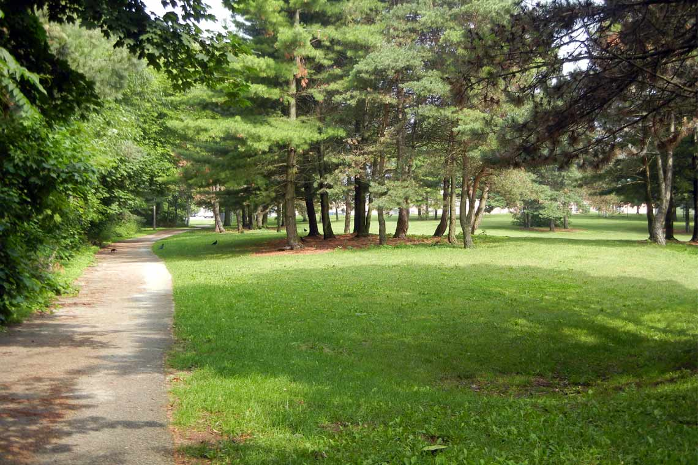

# Innovation Project
 

## Problem

The problem we chose is the fact that many parks and green spaces in our community are
underused, and by increasing the use of our parks and greenspaces, we can strengthen our
community.

## Solution

Our solution is a website that allows anyone to schedule fun activities that anyone else can join. It is specifically for scheduling activities in community parks and green spaces and the goal is to encourage people to get out and enjoy fun activities as a community.

## Sharing

As we developed our solution, we shared our idea by speaking with experts from the Town of Oakville. First we spoke with Councillor Tom Adams. He helped us develop our idea and suggested we contact Colleen Bell who is Oakville's Commissioner of Community Services. We were able to conduct an email interview with Commissioner Bell and her information also helped us improve our idea. Finally, to share our idea with everyone, our mentors helped us create a website that showcases our project.
