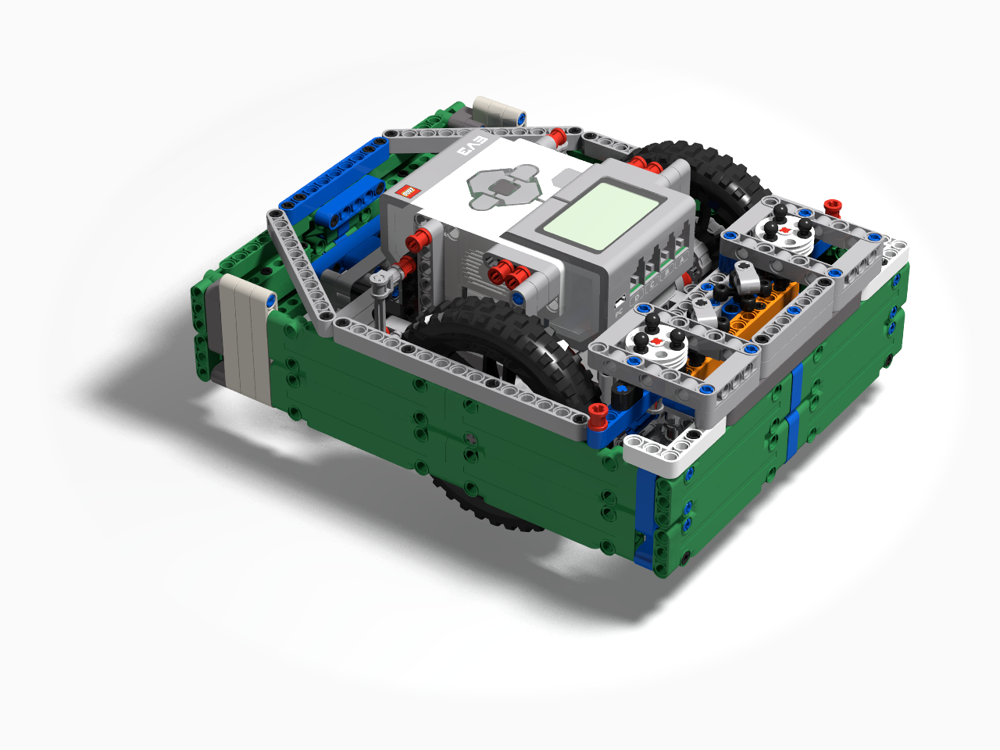

# Meet Willy
 

## Robot Facts

Our robot’s name is Willy. It and its attachments were built using a total of 658 LEGO pieces. Willy uses two large motors for driving and two medium motors to operate attachments. We programmed Willy using the EV3-G programming language and we plan to have 6 mission launches. If everything works properly, we can score 395 points.

Each of our mission programs are saved as MyBlocks and we use a menu program to make the launch process easier. Our mission programs use four other MyBlocks to complete specific tasks. Our most successful mission is Design & Build. Willy pushes three stacks with Sustainability Upgrades into a circle near the launch area for a total of 125 points.

## Fun

We had a lot of fun designing and programming Willy this season. We worked really hard together as a team to figure out which missions we wanted to do, and what design would work best. It was fun seeing our robot change from a very simple design into the robot it is now. It was really challenging, but all the team members shared ideas to help solve problems, which helped our team dynamic, especially at the start of the season.

## Strategy

Our strategy for picking missions was to start by picking close, easy ones that wouldn’t take too much time. We also grouped missions together so we could do multiple missions in one launch. Sometimes our choices didn’t work out. Many team members wanted to do the traffic jam mission, but we finally decided that the points weren’t worth the time required to do it. We have an 80%-100% success rate.

## Design Process

At the start of the season, we worked as a team to decide what capabilities Willy should have, such as wheel size and which sensors to use. Then we divided into small groups to try different ideas for the best solutions. We started building a very basic robot and gradually improved it. After the robot was finished, we continued making changes to Willy as we wrote the programs and tested them.

## Mechanical Design

Willy uses two large motors to drive and is supported by a caster wheel in the back. Willy’s attachments are able to be easily added and removed because they do not use permanent connections and they easily connect to the medium motor gears. Our design decisions allowed us to fit all of our equipment into the small inspection area so we can earn the advantage points.

## Programming

During the season we improved our code through repeated testing of Willy. We used MyBlocks so we didn’t repeat code, and to make it easier to read and understand. One MyBlock converts centimetres to wheel rotations so we just have to measure the distance Willy needs to travel and write it into the code. We used this conversion in two other MyBlocks that are used to drive a set distance. One of those MyBlocks also uses the motor rotation sensors for proportional control which makes smoother error corrections and allows Willy to drive straighter. Finally, we made a MyBlock that turns Willy a certain number of degrees.

## Innovation

Willy uses a dog gear system that allows us to quickly and easily connect attachments to the medium motors. We also built a frame around Willy that makes the wheels more stable because the axles cannot bend. This helps Willy drive more accurately and makes launch alignment easier. It also gives Willy a flat surface for pushing cargo around the game field.

## Sources of Inspiration and Credits

The following websites and people were instrumental for learning and inspiration during the season:
 
*   [EV3 Lessons](http://ev3lessons.com/en/)
*   [FLL Tutorials](http://flltutorials.com/)
*   [Kyle Markland aka Builderdude35](https://www.youtube.com/channel/UCuXq-jiU0ANeBcF_Tvq1D7g)
*   [Mr. Hino](https://www.youtube.com/channel/UCvuw_UluXNRPKhqK5GU8SrQ)
